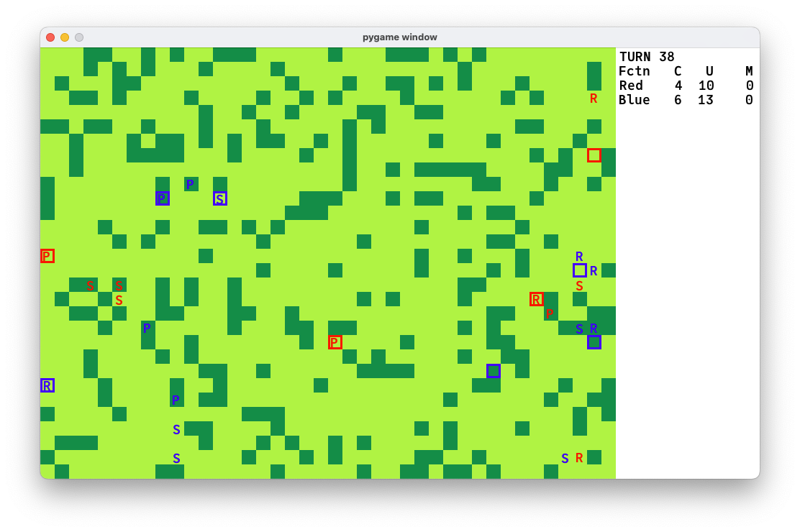

# 🧠 Rock-Paper-Scissors Tactical Game AI

This is a custom-built strategic AI for a turn-based, grid-based rock-paper-scissors (RPS) game. The game simulates two opposing factions (Red and Blue) competing for control of cities using RPS-style unit mechanics. The objective is to capture all cities by smartly building, defending, and attacking with units.

---

## 🎯 Objective

- Build a smart and adaptive AI that can:
  - Construct units based on a strategy.
  - Assign units to defend owned cities.
  - Coordinate the movement of units toward enemy threats.
  - Capture enemy cities using the RPS combat rules.

- Ensure continuous, purposeful gameplay without relying on randomness.

---

## 🕹️ Game Overview

- The map is a grid of cells. Each cell may contain terrain, a unit, or a city.
- Cities produce income and can build units.
- Units follow **rock-paper-scissors** logic in combat:
  - Rock > Scissors  
  - Scissors > Paper  
  - Paper > Rock  
- The game ends when one faction controls **all** cities.

---

## 🧩 AI Strategy

The AI logic is fully written in the `ai.py` file. 

### 1. Unit Building Logic

- At the start of every turn, the AI checks each of its cities.
- If a city is **not occupied** by a friendly unit, a new unit is built.
- Unit type is chosen in a looped pattern using modulo:
  - First city builds Rock (R)
  - Next builds Paper (P)
  - Then Scissors (S)
  - Then repeats

✅ Prevents overbuilding  
✅ Balances unit types  
✅ Keeps cities productive

### 2. Identifying Enemy Units and Cities

- The AI scans all cities and units on the map.
- It separates enemies from friendly entities and stores:
  - All **enemy units**
  - All **enemy cities**

✅ Helps plan attack routes  
✅ Switches strategy when no enemies are left

### 3. Defending Cities

- The AI chooses up to **two defenders** each turn.
- For each city, the closest available unit is assigned to guard.
- Distance is calculated using **Manhattan distance** (grid-based):
  ```python
  dist = abs(u.pos.x - c.pos.x) + abs(u.pos.y - c.pos.y)
  ```

- If a defender is not adjacent to its assigned city, it moves one step closer.

✅ Avoids over-committing to defense  
✅ Ensures quick city response  
✅ Uses logical direction via `dx`, `dy`:

```python
dx = city.pos.x - unit.pos.x
dy = city.pos.y - unit.pos.y
```

Based on which of `dx` or `dy` is larger, the AI chooses to move horizontally or vertically first (East/West or North/South).

### 4. Attacking Logic

- All units not assigned to defend become **attackers**.
- First, they look for the **nearest enemy unit**.
  - Move toward that enemy to engage in combat.
- If no enemy units exist, attackers will **target enemy cities** instead.

✅ Ensures continuous offensive action  
✅ Prevents AI from stalling or wandering  
✅ Captures cities and closes out the game

---

## 🧪 Testing and Debugging

To test the AI's performance:

- Added **print debugging** to track:
  - Unit builds
  - Defender assignments
  - Attack paths
- Played full game loops to ensure:
  - Cities change ownership correctly
  - Units behave logically
  - Game ends when one team wins
- Checked in-game indicators:
  - **C**: Cities owned
  - **U**: Units deployed
  - **M**: Money available

✅ Verified balanced gameplay  
✅ Confirmed winning states  
✅ Visual and log-based testing ensured correctness

---

## 📁 Files Used

- `ai.py` — contains **all** logic for the strategy AI.

---

## ✨ Summary

This AI follows a step-by-step, structured approach to win the game:
- Builds units methodically
- Assigns defenders smartly
- Attacks with intention
- Switches targets logically
- Finishes the game completely

It uses **deterministic decision-making** rather than randomness, giving the AI a thoughtful and strategic feel. The logic is clear, efficient, and easy to follow — ideal for learning about basic AI behavior in grid-based tactical games.

---

## 📸 Screenshots


---

## 🏁 How to Run

1. Clone the repository  
2. Run the game using:
```bash
python main.py
```
3. Observe the AI build, defend, and attack its way to victory!

---

## 📌 Notes

This was a fun project to implement strategy in a simple grid-based game environment. The AI logic is adaptable and can be expanded further with group coordination, advanced enemy prediction, or pathfinding in the future.

---
